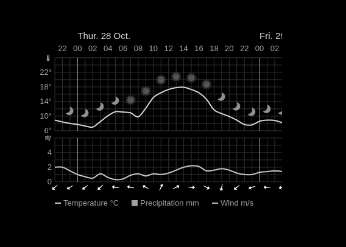

# Magic Mirror Module: mmm-weatherchart
This [MagicMirror2](https://github.com/MichMich/MagicMirror) module allows you to show a weather diagram provided by http://www.yr.no




## Installation

In your terminal, go to your MagicMirror's Module folder:
````
cd ~/MagicMirror/modules
````

Clone this repository:
````
git clone https://github.com/paphko/mmm-weatherchart.git
````

Install module:
````
cd mmm-weatherchart
npm install
````

Configure the module in your `config.js` file.

## Using the module

To use this module, you must first determine country, area, and city:

1. go to http://www.yr.no
2. enter your location into the search field at the top and select your city
3. at the top-right, switch language to English
4. write down country, area, and city from the current URL, e.g.: http://www.yr.no/place/Germany/North_Rhine-Westphalia/Duisburg/

Now add the module to the modules array in the `config/config.js` file:
````javascript
modules: [
	{
		module: 'mmm-weatherchart',
		position: 'bottom_left', // this can be any of the regions
		config: {
			country: 'Germany', // as determined above
			area: 'North_Rhine-Westphalia', // as determined above
			city: 'Duisburg', // as determined above
			updateInterval: 60 * 60 * 1000, // update every hour
			hideBorder: true, // whether or not a border with city name should be shown
			negativeImage: true, // whether or not the default white image should be inverted
			hoursToShow: 24, // Cut the image down to show less than the full 48 hour forecast. -1 to show everything.
			// mmDirectory: "/home/pi/MagicMirror/" // required for caching; adjust if it differs
		}
	},
]
````

## Configuration options

The following properties can be configured:


<table width="100%">
	<!-- why, markdown... -->
	<thead>
		<tr>
			<th>Option</th>
			<th width="100%">Description</th>
		</tr>
	<thead>
	<tbody>
		<tr>
			<td><code>country</code></td>
			<td>Your country as determined above</td>
		</tr>
		<tr>
			<td><code>area</code></td>
			<td>Your area as determined above</td>
		</tr>
		<tr>
			<td><code>city</code></td>
			<td>Your city name as determined above</td>
		</tr>
		<tr>
			<td><code>updateInterval</code></td>
			<td>Update interval of the diagram.
				<br><b>Default value:</b> <code>60 * 60 * 1000</code> (once every hour)
			</td>
		</tr>
		<tr>
			<td><code>hideBorder</code></td>
			<td>Whether or not a border with city name should be shown.
				<br><b>Default value:</b> <code>true</code>
			</td>
		</tr>
		<tr>
			<td><code>negativeImage</code></td>
			<td>Whether or not the white image should be inverted.
				<br><b>Default value:</b> <code>true</code>
			</td>
		</tr>
		<tr>
			<td><code>hoursToShow</code></td>
			<td>Cut the forecast down to this many hours (for a narrower picture).
				<br><b>Default value:</b> <code>-1</code> (show full forecast)
			</td>
		</tr>
		<tr>
			<td><code>mmDirectory</code></td>
			<td>To avoid the image to be cached by the browser (issue #5), it is downloaded into the magic mirror / modules / mmm-weatherchart / cache folder.
				I couldn't find a way to ask MM for this path, so I just hard-coded it here with the possibility to adjust it in case your installation looks different.
				<br><b>Default value:</b> <code>/home/pi/MagicMirror/</code>
			</td>
		</tr>
	</tbody>
</table>
